# 介绍
**注意：本教程只适用于部署使用Onscripter引擎的游戏。**

众所周知，Onscripter引擎的最初设计目的就是为了方便跨平台移植用NScripter编译的游戏，所以得益于它高度可移植的SDL库，ONS游戏移植相对比较简单。

我们需要用到的是这个叫 [OnscripterYuri](https://github.com/YuriSizuku/OnscripterYuri) 的项目，这个项目是基于 [ONScripter-Jh](https://github.com/jh10001/ONScripter-Jh) 开发的，在原本只支持`Android`的基础上增加了对`Windows`, `Linux`, `Mac`, `Web`, `RetroArch`和`PSV`的支持，可以将Ons游戏做成纯静态网页部署在服务器或Pages上。

项目地址：
::github{repo="YuriSizuku/OnscripterYuri"}
# 一、准备工作
## 1、安装Python
**如果电脑上已经安装了Python的话可以跳过这一步**

首先打开[Python官网](https://www.python.org/downloads/)，下载红色箭头指的独立安装程序
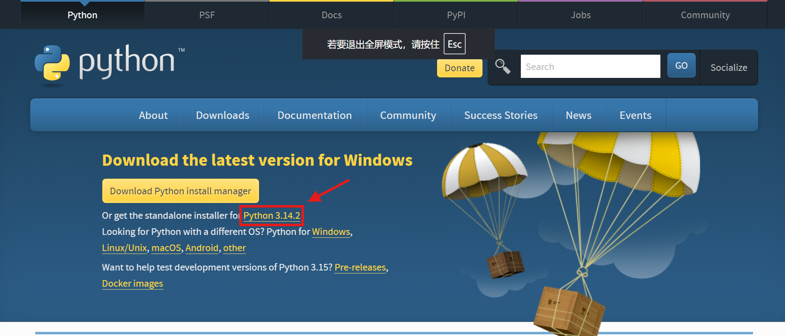
下载完成后运行exe文件，勾选Add PATH后安装
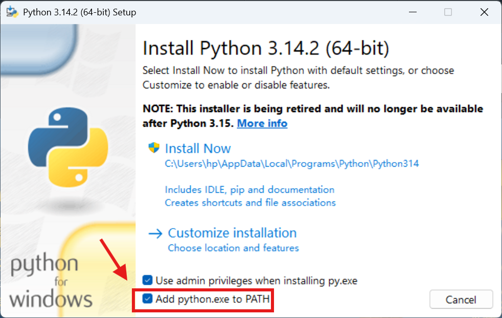

## 2、下载OnscripterYuri
打开项目的[下载地址](https://github.com/YuriSizuku/OnscripterYuri/releases/latest)，下载web版本
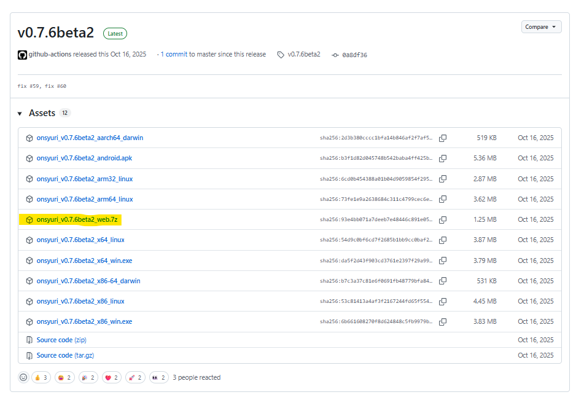
解压后是这样的
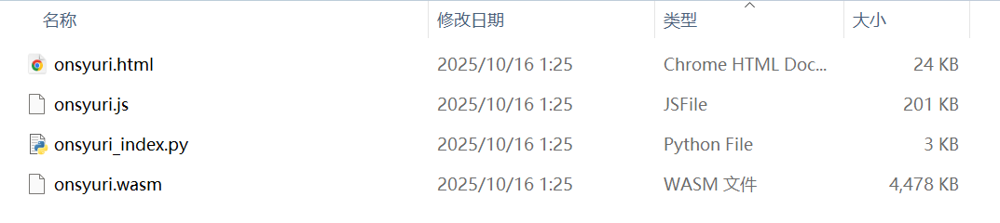
为了方便，我们将文件`onsyuri.html`名字改成`index.html`
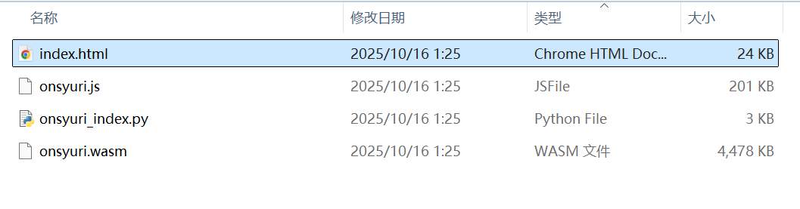

# 二、添加游戏
有两种构建方式：解包/不解包

## 1、游戏不解包(极不推荐，但简单)

**注意：由于游戏没有解包，每次游玩需要缓存整个nsa游戏文件，不仅加载时间久，而且手机游玩大概率会闪退。**

下载好你要玩的Ons游戏，这里以ever17为例，直接将全部文件解压到OnsYuri的文件夹，不用做任何处理
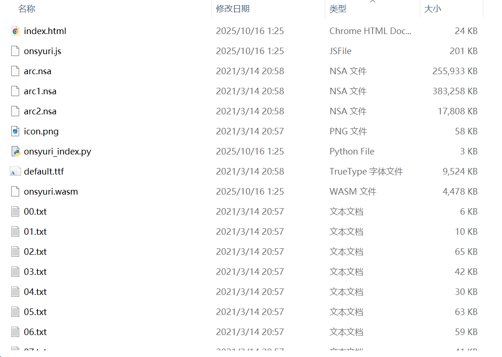
在文件路径栏输入`cmd`，然后回车，会出现命令行窗口。
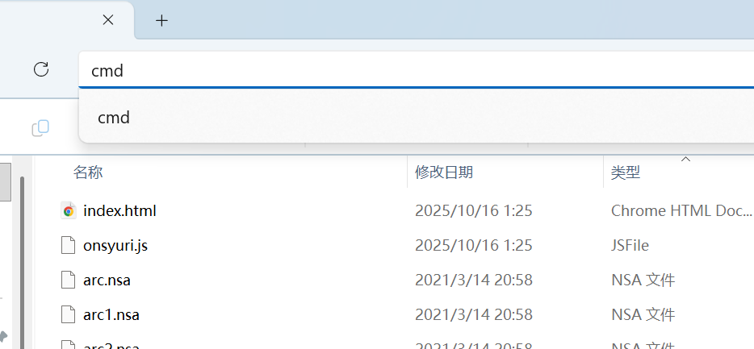
在命令行窗口中输入`py onsyuri_index.py`，然后回车。
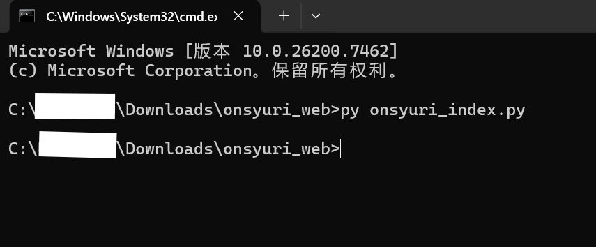
这样就已经完成了。

## 2、游戏解包(推荐)
下载好你要玩的Ons游戏，这里以ever17为例，将全部文件解压到OnsYuri的文件夹

下载解包软件[ExtractData](https://github.com/lioncash/ExtractData/releases/latest)，解压后得到该文件夹

运行exe文件，点击Open File
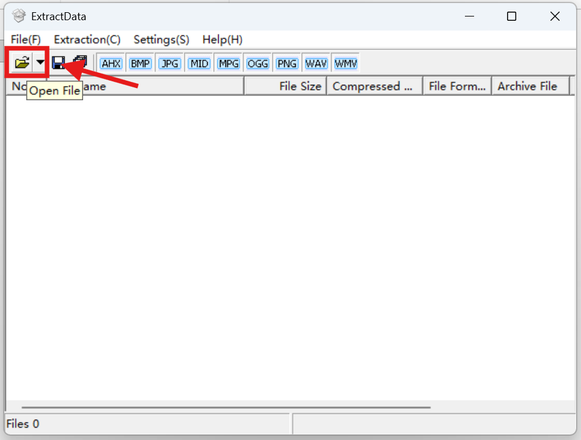
选中所有后缀为`.nsa`的文件
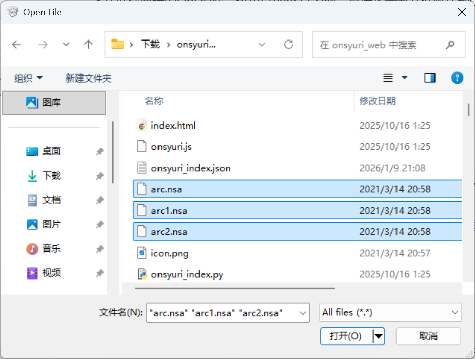
点击Extract all，选择解压到OnsYuri的文件夹内(和刚刚选中的`.nsa`文件同目录)
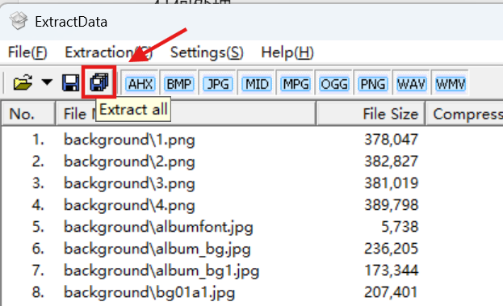
这样游戏内容就已经提取出来了，可以将刚刚选中的`.nsa`文件删掉了。
在文件路径栏输入`cmd`，然后回车，会出现命令行窗口。

在命令行窗口中输入`py onsyuri_index.py --lazyload`，然后回车。
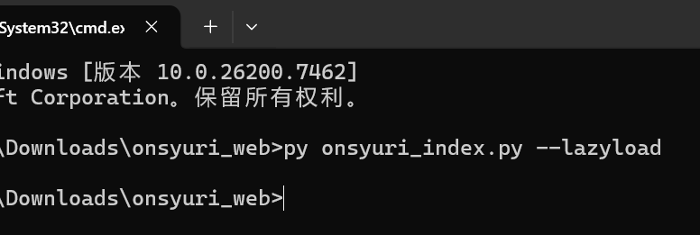
这样就大功告成了。

# 三、启动游戏
在宝塔面板/1Panel等面板中添加站点就可以游玩了。

也可以将文件夹压缩成压缩包上传并部署至CloudflarePages、Vercel等无服务器平台。

如果嫌麻烦，可以在刚刚的命令行窗口中输入`py -m http.server`启动网页服务，然后在浏览器输入`http://127.0.0.1:8000`或`http://localhost:8000`游玩
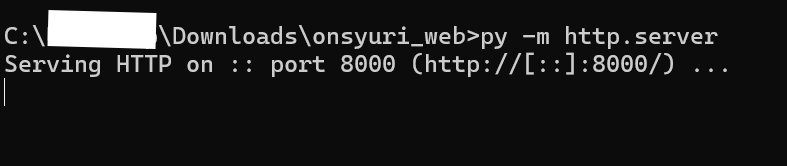
如果不想使用8000端口，可以输入`py -m http.server 数字`，然后在浏览器输入`http://127.0.0.1:数字`或`http://localhost:数字`游玩
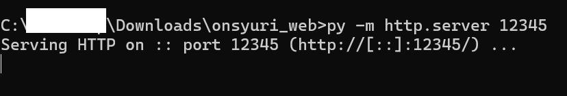
接下来就可以尽情游玩了
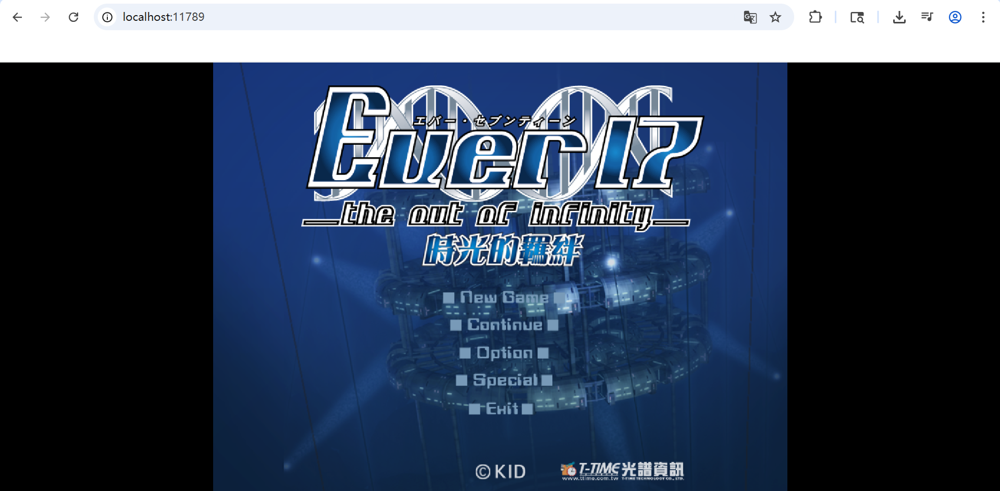

# 四、注意事项
最外层目录（即存放OnsYuri的文件夹）名字中不能包含大写字母，但可以包含中文。